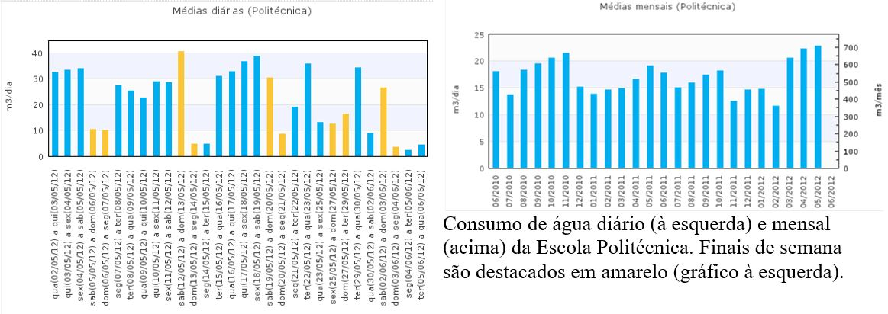

#CONTROLE ESTATÍSTICO DE PROCESSOS
```{r, include=FALSE}
library("mime")
library("stringi")
library("magrittr") 
library("Rcpp")
library("evaluate")
library("digest")
library("formatR")
library("highr")
library("markdown")
library("stringr")
library("yaml")
library("bitops")
library("caTools")
library("htmltools")
library("knitr")
library("rmarkdown")
library("e1071")
library("fBasics")
library("DAAG")
library("MASS")
library("fdth")
library("dplyr")
library("moments")
library("qcc")
library("rafalib")
library("reshape2")
library("survey")
library("raster")
library("knitr")
library("FrF2")
```

##QUESTÃO CEP2
O programa Águapura vem atuando na redução do consumo de água da UFBA, tendo obtido resultados significativos através de um acompanhamento sistemático vianet do consumo porunidade [](http://teclim.ufba.br/aguapura/index.php), ver exemplo abaixo. Considerando conceitos da estatística:



a) Proponha outra(s) forma(s) de acompanhamento do consumo de água da UFBA. 

b) Descreva todas as premissas e implicações consideradas na(s) sua(s) proposta(s).

###Resposta letra a)
Existem outros modos para acompanhamento dos dados coletados tais como, a realização de histogramas, construção de tabela de frequências, histogramas das frequências, construção de cartas de controle e boxplots. Outra opção é a construção de gráficos do consumo de água por andar, ou por departamento, no caso da escola Politécnica, e ainda por curso. É possível também correlacionar com o número de alunos matriculados em disciplinas ministradas naquele semestre e que possívelmente estão utilizando os sanitários e bebedouros. Outra idéia interessante é avaliar os laboratórios que utilizam muita água em seus ensaios. Há ainda a opção de realizar a análise por estação do ano.

###Resposta letra b)
Ao realizar a segregação na coleta de dados, deve-se partir do ponto de que há diferença nas distribuições, e que ao se realizar a média das médias e realizar um histograma que contém tais médias, ao invés de mostrar a realidade, tal forma de apresentação dos dados pode simplesmente distorcer os reais dados.
