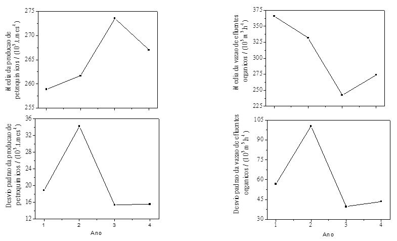

#ESTATÍSTICA DESCRITIVA
```{r, include=FALSE}
library("mime")
library("stringi")
library("magrittr") 
library("Rcpp")
library("evaluate")
library("digest")
library("formatR")
library("highr")
library("markdown")
library("stringr")
library("yaml")
library("bitops")
library("caTools")
library("htmltools")
library("knitr")
library("rmarkdown")
library("e1071")
library("fBasics")
library("DAAG")
library("MASS")
library("fdth")
library("dplyr")
library("moments")
library("qcc")
library("rafalib")
library("reshape2")
library("survey")
library("raster")
library("knitr")
```

## QUESTÃO ED5
Séries históricas de produção de petroquímicos e vazão de efluentes orgânicos de uma determinada empresa foram avaliados considerando médias anuais de 4 anos. O engenheiro responsávelpor esse processo informou que com o aumento de produção  há um maior consumo de matérias primas e insumos, e que no 2º ano houve muitas paradas na planta.

```{r, echo=FALSE}
setwd(paste(getwd(),"/DBED",sep=""))
```



```{r, echo=FALSE}
setwd("../")
```

a) Discuta o que acontece com a vazão de efluentes, e sua relação com a produção, considerando estas informações.

###Resposta letra a)
A princípio, os gráficos acima indicam certa correlação inversa entre as variáves **Média da produção de petroquímicos** e **Média da vazão de efluentes orgânicos**. Nota-se um significativo aumento do desvio padrão das variáveis em estudo no  2º ano de produção, possivelmente devido à ocorrência de muitas paradas na unidade.

A correlação inversa entre as variáves **Média da produção de petroquímicos** e **Média da vazão de efluentes orgânicos** pode ser explicada devido ao provável afastamento do ponto de máxima eficiência operacional causado pela redução da média de produção de petroquímicos. De uma forma geral unidades industriais possuem pontos de máxima eficiência próximos a capacidade máxima de operação.