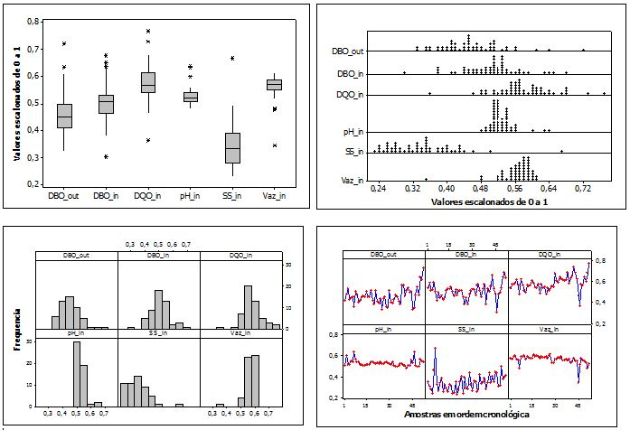

---
output:
  html_document:
    toc_depth: 6
  pdf_document:
    toc_depth: '6'
---
#QUESTÕES UNIFICADAS
```{r, include=FALSE}
library("mime")
library("stringi")
library("magrittr") 
library("Rcpp")
library("evaluate")
library("digest")
library("formatR")
library("highr")
library("markdown")
library("stringr")
library("yaml")
library("bitops")
library("caTools")
library("htmltools")
library("knitr")
library("rmarkdown")
library("e1071")
library("fBasics")
library("DAAG")
library("MASS")
library("fdth")
library("dplyr")
library("moments")
library("qcc")
library("rafalib")
library("reshape2")
library("survey")
library("raster")
library("knitr")
library("FrF2")
library("BSDA")
library("psych")
library("corrplot")
```

##QUESTÃO QU2
Deseja-se caracterizar a qualidade do efluente tratado de uma indústria de papel e celulose atravésdo parâmetro demanda bioquímica de oxigênio (DBO_out), medido na saída do sistema de tratamento orgânico. Os demais parâmetros de qualidade apresentados são analisados no afluente da estação de tratamento: demanda bioquímica de oxigênio (DBO_in), demanda química de oxigênio (DQO_in), pH (pH_in), sólidos em suspensão (SS_in) e vazão (Vaz_in). Na Figura 1 e Quadro 1 são apresentados alguns gráficos e estatísticas utilizados para o monitoramento do processo. (6,0 PONTOS)



```{r, echo=FALSE}
setwd(paste(getwd(),"/DBQU",sep=""))

LQQU2 <- read.table(file = "LQQU2.txt",
                      header = TRUE)
knitr::kable(LQQU2, align = 'c')

setwd("../")
```

a) Avalie criticamente se há melhoria da qualidade do efluente tratado considerando os gráficos apresentados na Figura 1, as estatísticas apresentadas no Quadro 1 e um nível de confiança de 90%.

b) O engenheiro responsável pela operação e gestão da qualidade do sistema de tratamento de efluentes da empresa decide não utilizar a incerteza de medições para caracterizar a dispersão dos valores que podem ser atribuídos aos parâmetros que definem a qualidade do afluente e efluente tratado. Critique a decisão do engenheiro.

c) Uma análise específica será realizada considerando dados com maior probabilidade de ocorrência. Qual o valor limite do pH caso deseje-se considerar nesta análise dados com probabilidade superior a 80%?

###Resposta letra a)
Considerando que não existe diferênça entre as variãncias dos conjuntos de dados *DBO_in* e *DBO_out*, calculou-se o intervalo de confiânça para a diferença de médias para variâncias desconhecidas e iguais. Como o valor zero não está presenta no intervalo de confiânça para a diferença entre as médias, é possóvel concluir que existe melhoria da qualidade do elfuente tratado considerando um nível de confiânça de 90% 

```{r}
alpha <- 0.1

n1 <- LQQU2$Amostra[2]
n2 <- LQQU2$Amostra[1]

x1 <- LQQU2$Media[2]
x2 <- LQQU2$Media[1]

sd1 <- LQQU2$DP[2]
sd2 <- LQQU2$DP[1]

t.alpha <- qt(p = alpha/2, df = (n1+n2-2), lower.tail = FALSE)

sp2 <- ((n1-1)*sd1^2 + (n2-1)*sd2^2) / (n1+n2-2)
                
sp <- sqrt(sp2)

LI <- x1 - x2 - t.alpha*sp*sqrt((1/n1)+(1/n2))
LS <- x1 - x2 + t.alpha*sp*sqrt((1/n1)+(1/n2))

knitr::kable(data.frame(LI, LS), align = 'c')
```

###Resposta letra b)
Não não utilização das incertezas da medições (desvio padrão) pode levar à conclusões equivocadas quanto a melhoria da qualidade do efluente devido à pequena ordem de grandeza dos dados avaliados.

###Resposta letra c)
Considerando que os dados são provenientes de uma distribuição normal, temos:
```{r}
qnorm(p = 0.8, sd = LQQU2$DP[4], mean = LQQU2$Media[4])
```