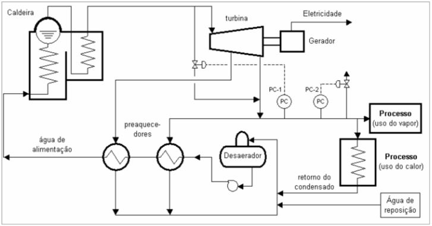
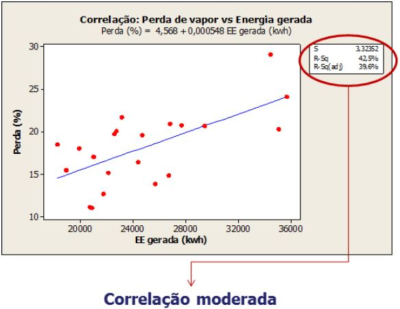

#QUESTÕES UNIFICADAS
```{r, include=FALSE}
library("mime")
library("stringi")
library("magrittr") 
library("Rcpp")
library("evaluate")
library("digest")
library("formatR")
library("highr")
library("markdown")
library("stringr")
library("yaml")
library("bitops")
library("caTools")
library("htmltools")
library("knitr")
library("rmarkdown")
library("e1071")
library("fBasics")
library("DAAG")
library("MASS")
library("fdth")
library("dplyr")
library("moments")
library("qcc")
library("rafalib")
library("reshape2")
library("survey")
library("raster")
library("knitr")
library("BSDA")
```

##QUESTÃO QU3
O processo de geração e distribuição de vapor, bem como o sistema de co-geração, de uma determinada indústria podem ser representados pela figura 1. O primeiro controlador (PC-1) controla a pressão do sistema de distribuição de vapor de média pressão (15 kgf/cm2) em uma faixa de modo a evitar que fique abaixo de um valor requerido. Para isto, quando ocorre diminuição da pressão do sistema de distribuição de vapor, o controlador PC-1 comanda a abertura de uma válvula redutora de pressão que injeta vapor diretamente na linha de distribuição, sem passar pela turbina. O segundo controlador (PC-2) controla a pressão do sistema de distribuição de vapor em outra faixa, evitando que a pressão fique acima de um valor definido como seguro para o processo. Para fazer esse controle, o PC-2 comanda a abertura de uma válvula de alívio que lança na atmosfera o excesso de vapor, gerando perdas de vapor e, consequentemente, de água e energia.



```{r, echo=FALSE}
setwd(paste(getwd(),"/DBQU",sep=""))

LQQU3 <- read.table(file = "LQQU3.txt",
                      header = TRUE)
LQQU3.1 <- read.table(file = "LQQU3.1.txt",
                      header = TRUE)
knitr::kable(LQQU3, align = 'c')

setwd("../")
```

```{r, echo=FALSE}
sumario.perda <- as.vector(summary(LQQU3$Perda))
sd.perda <- as.vector(round(sd(LQQU3$Perda), digits = 2))
a <- matrix(c(sumario.perda, sd.perda), nrow = 1, ncol = 7)


sumario.perda.so <- as.vector(summary(LQQU3.1$Perda))
sd.perda.so <- as.vector(round(sd(LQQU3.1$Perda), digits = 2))
b <- matrix(c(sumario.perda.so, sd.perda.so), nrow = 1, ncol = 7)

c <- rbind(a, b)
rownames(c) <- c("% Perda", "% Perda (sem outlier)")
colnames(c) <- c("Min", "Q1", "Mediana", "Média", "3Q", "Max", "DesPad")
knitr::kable(c, align = 'c')

par(mfrow = c(1,2))
boxplot(x = LQQU3$Perda,
        xlab = "% Perda",
        ylab = "Dados")
boxplot(x = LQQU3.1$Perda,
        xlab = "% Perda (sem outlier)",
        ylab = "Dados")
hist(x = LQQU3$Perda,
     main = "",
     xlab = "% Perda",
     ylab = "Frequência Absoluta")
hist(x = LQQU3.1$Perda,
     main = "",
     xlab = "% Perda (sem outlier)",
     ylab = "Frequência Absoluta")
```



A Figura 2 mostra que 40% da perda de vapor pode ser explicada pela relação entre a geração de energia elétrica pelas turbinas, sendo esta e o alívio de vapor as principais fontes de variação a serem analisadas. Na Tabela 1 são apresentados os dados de perda de vapor e consumo de energia elétrica.

a) Estime as estatísticas descritivas de média e desvio padrão dos dados referentes a perda de vapor da Tabela 1 considerando um nível de confiança de 95%. Discuta os resultados considerando as informações apresentadas no Quadro 1 e Figura 1.

b) Selecionando-se uma unidade amostral ao caso: (a) Qual a probabilidade que esta amostra tenha perda superior a 25%. (b) Qual deve ser a perda de vapor para que 95% da perda seja inferior a 25%?

c) **(a)** Considerando que o engenheiro responsável pelo processo acha o intervalo estimado no item 1(a) muito grande, quantas amostrar ele deveria ter para um intervalo de 95% com erro menor que 0,5% de perdas de vapor? **(b)** Esperava-se que a perda média de vapor da unidade não ultrapasse 18%, ao nível de confiança de 95%, para que não haja atuação manual no processo. Verifique se este procedimento deve ser alterado com base na teoria de teste de hipóteses. Avalie a influência da alteração do nível de confiança para 99% sobre os erros do tipo 1 para este sistema.

d) Acredita-se que os dados de perda de vapor (t/mês) e produção (t/mês) sejam correlacionados.

d.1. Verifique se essa afirmação é verdadeira considerando os resultados apresentados no Quadro 2 e Figura 4. Não se esqueça de utilizar também a teoria do teste de hipóteses nas suas justificativas.

```{r, echo=FALSE}
modelo.QU3 <- lm(formula = Perda.Total ~ Producao.Total, data = LQQU3)
summary(modelo.QU3)
anova(object = modelo.QU3)

par(mfrow = c(2,2))
qqnorm(modelo.QU3$residuals, pch = 20, col = "red")
qqline(y = modelo.QU3$residuals, col = 4, lwd=2,lty=2)
plot(x = modelo.QU3$fitted.values, y = modelo.QU3$residuals,
     main = "Resíduos X Valores Ajustados",
     ylab = "Resíduos",
     xlab = "Valores Ajustados",
     pch = 20,
     col = "red")
lines.default(rep(0, 9000), col = "black")
hist(x = modelo.QU3$residuals,
     main = "Histograma dos Resíduos",
     ylab = "Frequência Absoluta",
     xlab = "Resíduos",
     col = "grey")
plot(x = seq(1,nrow(LQQU3)), y = modelo.QU3$residuals,
     main = "Resíduos X Observação",
     ylab = "Resíduos",
     xlab = "Observação",
     type = "l",
     col = "blue")
points(modelo.QU3$residuals, pch = 20, col = "red")
lines.default(rep(0, 9000), col = "black")
```

d.2. Proponha um algoritmo para construção de um modelo de regressão multivariado. Considere que variações na temperatura ambiente, pressão na linha de distribuição e percentual de condensado na linha podem causar variações na perda de vapor. Considere a possibilidade de existir diferentes padrões por turno de produção (7-15h, 15-23h, 23-07h), relações não lineares, correlação entre variáveis preditoras, valores aberrantes, etc.

###Resposta letra a)
```{r}
# Estimativa do intervalo de confiânça para média e variância para o conjunto total de dados de perda de vapor (%).

n         <- nrow(LQQU3)
xbarra    <- mean(LQQU3$Perda)
sd.perda  <- sd(LQQU3$Perda)
var.perda <- var(LQQU3$Perda)
alpha = 0.05

LI.mu.perda <- xbarra - qt(p = alpha/2, df = n-1, lower.tail = FALSE)*sd.perda/sqrt(n)
LS.mu.perda <- xbarra + qt(p = alpha/2, df = n-1, lower.tail = FALSE)*sd.perda/sqrt(n)

LI.var.perda <- ((n-1)*sd.perda^2)/qchisq(0.95, df = n-1, lower.tail = TRUE)
LS.var.perda <- ((n-1)*sd.perda^2)/qchisq(0.05, df = n-1, lower.tail = TRUE)

a <- matrix(c(LI.mu.perda, LS.mu.perda, LI.var.perda, LS.var.perda), nrow = 2, ncol = 2)
colnames(a) <- c("Média", "Variância")
rownames(a) <- c("LI", "LS")
knitr::kable(a, align = 'c')

shapiro.test(LQQU3$Perda)
```

```{r}
# Estimativa do intervalo de confiânça para média e variância para o conjunto de dados de perda de vapor (%) sem outliers.

n         <- nrow(LQQU3.1)
xbarra    <- mean(LQQU3.1$Perda)
sd.perda  <- sd(LQQU3.1$Perda)
var.perda <- var(LQQU3.1$Perda)
alpha = 0.05

LI.mu.perda <- xbarra - qt(p = alpha/2, df = n-1, lower.tail = FALSE)*sd.perda/sqrt(n)
LS.mu.perda <- xbarra + qt(p = alpha/2, df = n-1, lower.tail = FALSE)*sd.perda/sqrt(n)

LI.var.perda <- ((n-1)*sd.perda^2)/qchisq(0.95, df = n-1, lower.tail = TRUE)
LS.var.perda <- ((n-1)*sd.perda^2)/qchisq(0.05, df = n-1, lower.tail = TRUE)

a <- matrix(c(LI.mu.perda, LS.mu.perda, LI.var.perda, LS.var.perda), nrow = 2, ncol = 2)
colnames(a) <- c("Média (sem outlier)", "Variância (sem outlier)")
rownames(a) <- c("LI", "LS")
knitr::kable(a, align = 'c')

shapiro.test(LQQU3.1$Perda)
```

Estimou-se as estatísticas descritivas de média e variância dos dados referentes a perda de vapor com e sem a presença de outliers. Nota-se que a presença do outlier provoca o aumento dos valores da média e variância (e da amplitude de seus intervalos de confiânça) da perda de vapor. A observação dos histogramas e boxplotes permite a realização de uma análise qualitativa quanto ao formato da distribuição dos dados. Nota-se que a presença do outlier afasta a distribuição da normalidade alongando a cauda à direita. Realizou-se o teste de Shapiro-Wilk com o objeetivo de se obter uma resposta quantitativa para a análise da normalidade das duas distribuições. O teste de Shapiro-Wilk confirma o desvio da normalidade gerado pela preseça do outlier.

###Resposta letra b)
A probabilidade que a amostra original de dados de perda de vapor em % tenha perda superior a 25% é:

```{r}
round(pnorm(q = 25, mean = mean(LQQU3$Perda), sd = sd(LQQU3$Perda), lower.tail = FALSE), digits = 3)
```

Já a probabilidade que a amostra sem a presença do outlier tenha perda superior a 25% é:

```{r}
round(pnorm(q = 25, mean = mean(LQQU3.1$Perda), sd = sd(LQQU3.1$Perda), lower.tail = FALSE), digits = 3)
```

Considerando a amostra original, a perda de vapor para que 95% da perda seja inferior a 25% é:

```{r}
Z0 <- qnorm(p = 0.95)
round(Z0*(sd(LQQU3$Perda)/sqrt(nrow(LQQU3)))+mean(LQQU3$Perda), digits = 3)
```

Considerando a amostra sem a presença de outliers, a perda de vapor para que 95% da perda seja inferior a 25% é:

```{r}
Z0 <- qnorm(p = 0.95)
round(Z0*(sd(LQQU3.1$Perda)/sqrt(nrow(LQQU3.1)))+mean(LQQU3.1$Perda), digits = 3)
```

###Resposta letra c)
**c.(a)**

Considerando a amostra original de dados de perdad de vapor em %, o tamanho da amostra necessário para a cosntrução de um intervalo com 95% de confiânça e com erro inferior a 0,5% é:

```{r}
erro <- 0.5
n    <- ((qnorm(p = 0.05/2, lower.tail = TRUE)*sd(LQQU3$Perda))/erro)^2

print(round(n))
```

Se considerarmos a amostra sem a presença de outliers, o tamanho da amostra necessário para a cosntrução de um intervalo com 95% de confiânça e com erro inferior a 0,5% é:

```{r}
erro <- 0.5
n    <- ((qnorm(p = 0.05/2, lower.tail = TRUE)*sd(LQQU3.1$Perda))/erro)^2

print(round(n))
```

Nota-se a redução significativa do tamanho de amostra necessário com a retirada dos outliers.

**c.(b)**

Com o objetivo de verificar a necessidade de alteração do procedimento realizou-se testes de hipótese para a média dos conjuntos de dados com e sem outliers.

```{r}
z.test(x = LQQU3$Perda,
       sigma.x = sd(LQQU3$Perda),
       mu = 18,
       alternative = "less",
       conf.level = 0.95)

z.test(x = LQQU3.1$Perda,
       sigma.x = sd(LQQU3$Perda),
       mu = 18,
       alternative = "less",
       conf.level = 0.95)
```

Realizou-se um teste Z para avaliar se a perda média de vapor da unidade é inferior a 18%. Os testes foram realizados considerando os dados com e sem a presença de outliers.

O teste Z, para o conjunto total de dados, falhou em rejeitar a hipótese nula na qual a perda de vapor é igual a 18%. Com base na teoria de teste de hipótese este procedimento deve ser alterado, pois não é possível afirmar que a média da perda de vapor é inferior a 18%.

Já o teste Z, para o conjunto de dados sem outliers, rejeitou a hipótese nula na qual a perda de vapor é igual a 18%. Com base na teoria de teste de hipótese não é necessário alterar este procedimento, pois a média verdadeira da perda de vapor será inferior a 18% em 95% das amostragens.

Construiu-se o código abaixo para avaliar a influência da alteração do nível de confiança para 99% sobre os erros do tipo 1 para este sistema.

```{r}
z.test(x = LQQU3$Perda,
       sigma.x = sd(LQQU3$Perda),
       mu = 18,
       alternative = "less",
       conf.level = 0.99)

z.test(x = LQQU3.1$Perda,
       sigma.x = sd(LQQU3$Perda),
       mu = 18,
       alternative = "less",
       conf.level = 0.99)
```

O aumento do nível de confiânça (diminuição do nível de significância alpha) torna inviável a rejeição da hipótese nula na qual a perda de vapor é igual a 18% para ambos os casos (com e sem outlier). Isso significa que, com base na teoria de teste de hipótese, é necessário alterar este procedimento, pois a média verdadeira da perda de vapor não será inferior a 18% em 99% das amostragens.

###Resposta letra d)
**d.1**

Com base na análise do modelo de regressão linear, na tabela de análise da variância e nos gráficos apresentados é possível concluir que existe uma correlação linear entre a perda de vapor (t/mês) e produção de vapor (t/mês).

O modelo de regressão linear proposto apresenta dois coeficientes: o linear (*Intercept*) e o angular (*Producao.Total*). O teste de hipótese realizado para avaliar a significância dos coeficientes do modelo de regressão se mostrou significativo para o coeficiente angular (*Producao.Total*), com um p-valor inferir ao nível de significância de 0.05. Já o teste de hipótese para a significância do coeficiente linear falhou em rejeitar a hipóse nula na qual o coeficiente é igual a zero. O modelo de regressão proposto apresenta R^2^ ajustado de `r round(summary(modelo.QU3)$adj.r.squared, digits = 3)`, indicando a porcentagem de perda total de vapor que pode ser explicado pelo presente modelo.

Através da inspeção da tabela de análises da variância (ANOVA) é possível concluir que o modelo de regressão proposto é significativo quanto à correlação entre *Produção.Total* e *Perda.Total*, devido ao resultado do p-valor (`r round(anova(object = modelo.QU3)$P[1], digits = 3)`) ser infeior ao nível de significância de 0,05.

Os gráficos aptresentados na questão são fundamentais na etapa de validação estatística do modelo de regressão. A validação da significância estatística do modelo de regressão imprescinde da normalidade e aleatoriedade dos respiduos. Como já foi discutido, o conjunto de dados original apresenta valores aberrantes que desviam a distribuição dos dados da normalidade. Logo, é possível notar um desvio da normalidade por parte dos resíduos do modelo de regressão.

Abaixo segue o código para costrução e validação de um novo modelo de regressão utilizando o conjunto de dados sem a presença de outliers e eliminando o coeficiente linear do modelo de regressão. O resultado é um modelo de regressão mais ajustado e validado.

```{r}
modelo.QU3 <- lm(formula = Perda.Total ~ -1 + Producao.Total, data = LQQU3.1)
summary(modelo.QU3)
anova(object = modelo.QU3)
shapiroTest(modelo.QU3$residuals)

par(mfrow = c(2,2))
qqnorm(modelo.QU3$residuals, pch = 20, col = "red")
qqline(y = modelo.QU3$residuals, col = 4, lwd=1,lty=2)
plot(x = modelo.QU3$fitted.values, y = modelo.QU3$residuals,
     main = "Resíduos X Valores Ajustados",
     ylab = "Resíduos",
     xlab = "Valores Ajustados",
     pch = 20,
     col = "red")
lines.default(rep(0, 9000), col = "black")
hist(x = modelo.QU3$residuals,
     main = "Histograma dos Resíduos",
     ylab = "Frequência Absoluta",
     xlab = "Resíduos",
     col = "grey")
plot(x = seq(1,nrow(LQQU3.1)), y = modelo.QU3$residuals,
     main = "Resíduos X Observação",
     ylab = "Resíduos",
     xlab = "Observação",
     type = "l",
     col = "blue")
points(modelo.QU3$residuals, pch = 20, col = "red")
lines.default(rep(0, 9000), col = "black")
```

**d.2**

