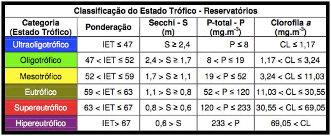
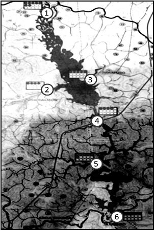

#QUESTÕES UNIFICADAS
```{r, include=FALSE}
library("mime")
library("stringi")
library("magrittr") 
library("Rcpp")
library("evaluate")
library("digest")
library("formatR")
library("highr")
library("markdown")
library("stringr")
library("yaml")
library("bitops")
library("caTools")
library("htmltools")
library("knitr")
library("rmarkdown")
library("e1071")
library("fBasics")
library("DAAG")
library("MASS")
library("fdth")
library("dplyr")
library("moments")
library("qcc")
library("rafalib")
library("reshape2")
library("survey")
library("raster")
library("knitr")
library("BSDA")
```

##QUESTÃO QU4
A eutrofização das águas é propiciada pelo incremento de nutrientes no corpo d'água, levando ao crescimento excessivo das plantas aquáticas, com consequente desequilíbrio do ecossistema aquático e progressiva degeneração da qualidade da água dos corpos d'água. A eutrofização, inicialmente, pode ocorrer de forma natural em ecossistemas aquáticos, todavia o estado trófico de lagos tem sido alterado principalmente pelo influxo de nutrientes provenientes do despejo de esgotos urbanos e industriais.

A avaliação de parâmetros de qualidade das águas de um rio pode permitir a análise de seu estado de eutrofização, sendo a clorofila um dos principais parâmetros de qualidade avaliados. O índice de eutrofização (IET), proposto pela CETESB, é utilizado para avaliar-se a eutrofização de corpos d'água. Nesse índice, usualmente, é considerado o fósforo como o agente principal causador da eutrofização e a clorofila deve ser considerada como uma medida da resposta do corpo hídrico ao agente causador. Assim, o índice médio engloba, de forma simplória, a causa e o efeito do processo, utilizando-se a média nos meses em que estejam disponíveis dados de ambas variáveis, conforme observado nas  faixas de trofia do Quadro 1.



Sólidos totais, turbidez, fósforo total, nitrogênio amoniacal, nitrogênio total, nitrato e clorofila A de um determinado rio em São Paulo foram levantados em seis pontos de amostragem (ver Figura 1) em dois períodos seco e úmido. Para estimativa do IET, utilizou-se dados históricos levantados no ponto 6. Com base no Quadro 1 e Figuras 1 a 7, conclua sobre a condição de eutrofização do rio X. Considere o ponto 6 como ponto de interesse na análise da eutrofização.



a)  Considerando novos dados de monitoramento levantados para o ano de 2012 apresentados no Quadro 2:

a.1.) Compare se há mudanças no estado de eutrofização do rio para os períodos seco e úmido considerando a avaliação de intervalos de confiança do IET e nível de significância de 10%.

a.2. Com base na teoria do teste de hipóteses, verifique, se possível, se o comportamento das amostras no período seco e úmido encontrado para o IET também é verificado para a clorofila e fosfato.

b) Considerando os dados apresentados no Quadro 2:

b.1. Qual a probabilidade de uma amostra selecionada ao acaso apresentar valores de IET na faixa trófica.

b.2. Uma análise específica será realizada considerando dados com maior probabilidade de ocorrência. Qual o valor limite de IET caso deseje-se considerar nesta análise dados com probabilidade superior a 80%?


