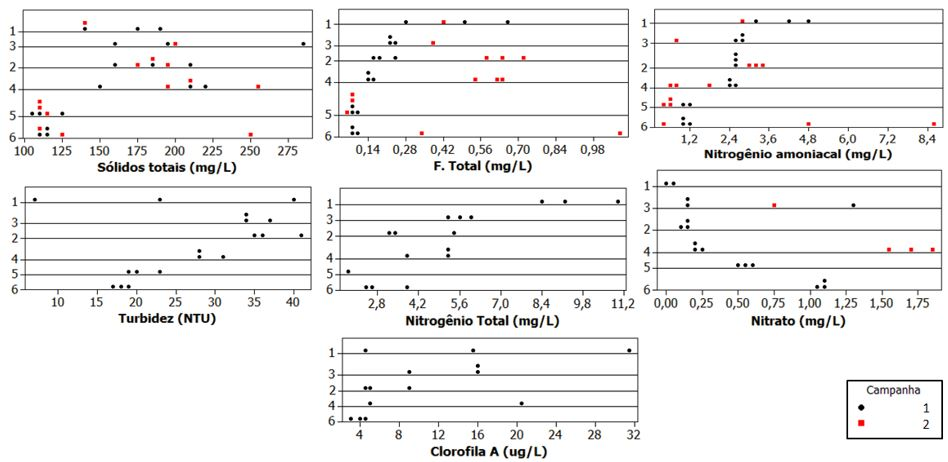
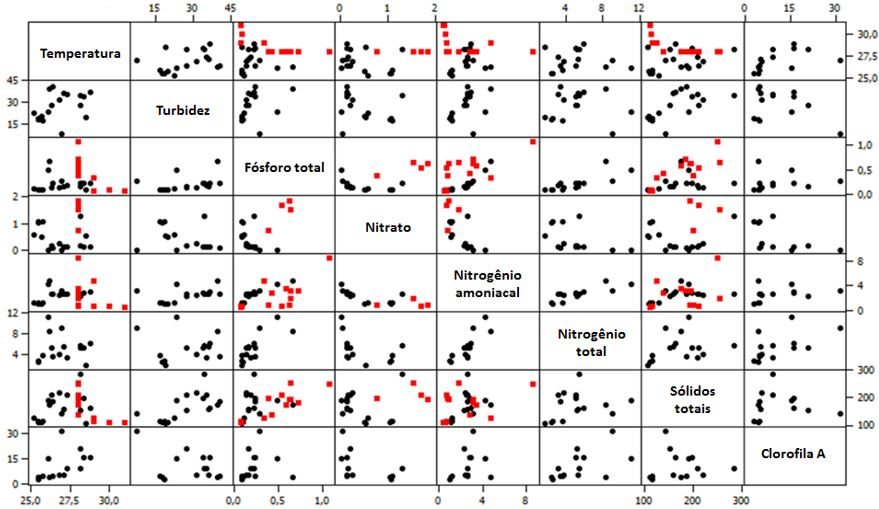
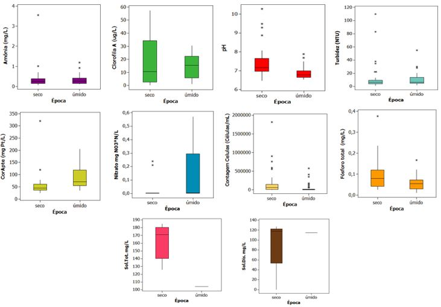
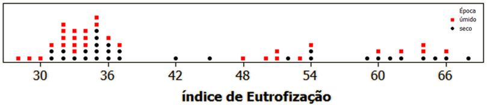
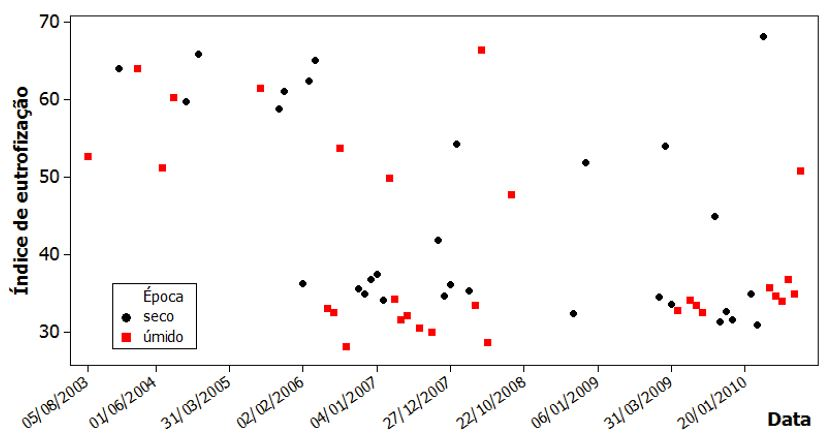
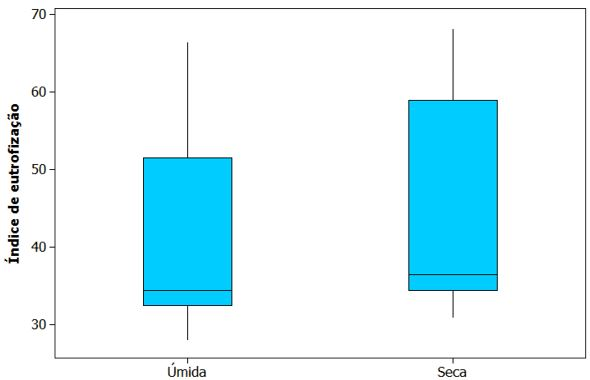

#QUESTÕES UNIFICADAS
```{r, include=FALSE}
library("mime")
library("stringi")
library("magrittr") 
library("Rcpp")
library("evaluate")
library("digest")
library("formatR")
library("highr")
library("markdown")
library("stringr")
library("yaml")
library("bitops")
library("caTools")
library("htmltools")
library("knitr")
library("rmarkdown")
library("e1071")
library("fBasics")
library("DAAG")
library("MASS")
library("fdth")
library("dplyr")
library("moments")
library("qcc")
library("rafalib")
library("reshape2")
library("survey")
library("raster")
library("knitr")
library("BSDA")
library("psych")
library("corrplot")
```

##QUESTÃO QU4
A eutrofização das águas é propiciada pelo incremento de nutrientes no corpo d'água, levando ao crescimento excessivo das plantas aquáticas, com consequente desequilíbrio do ecossistema aquático e progressiva degeneração da qualidade da água dos corpos d'água. A eutrofização, inicialmente, pode ocorrer de forma natural em ecossistemas aquáticos, todavia o estado trófico de lagos tem sido alterado principalmente pelo influxo de nutrientes provenientes do despejo de esgotos urbanos e industriais.

A avaliação de parâmetros de qualidade das águas de um rio pode permitir a análise de seu estado de eutrofização, sendo a clorofila um dos principais parâmetros de qualidade avaliados. O índice de eutrofização (IET), proposto pela CETESB, é utilizado para avaliar-se a eutrofização de corpos d'água. Nesse índice, usualmente, é considerado o fósforo como o agente principal causador da eutrofização e a clorofila deve ser considerada como uma medida da resposta do corpo hídrico ao agente causador. Assim, o índice médio engloba, de forma simplória, a causa e o efeito do processo, utilizando-se a média nos meses em que estejam disponíveis dados de ambas variáveis, conforme observado nas  faixas de trofia do Quadro 1.


Sólidos totais, turbidez, fósforo total, nitrogênio amoniacal, nitrogênio total, nitrato e clorofila A de um determinado rio em São Paulo foram levantados em seis pontos de amostragem (ver Figura 1) em dois períodos seco e úmido. Para estimativa do IET, utilizou-se dados históricos levantados no ponto 6. Com base no Quadro 1 e Figuras 1 a 7, conclua sobre a condição de eutrofização do rio X. Considere o ponto 6 como ponto de interesse na análise da eutrofização.














a)  Considerando novos dados de monitoramento levantados para o ano de 2012 apresentados no Quadro 2:

```{r, echo=FALSE}
setwd(paste(getwd(),"/DBQU",sep=""))

LQQU4.1 <- read.table(file = "LQQU4.1.txt",
                      header = TRUE)
knitr::kable(LQQU4.1, align = 'c')

LQQU4.2 <- read.table(file = "LQQU4.2.txt",
                      header = TRUE)
knitr::kable(LQQU4.2, align = 'c')

setwd("../")
```

a.1.) Compare se há mudanças no estado de eutrofização do rio para os períodos seco e úmido considerando a avaliação de intervalos de confiança do IET e nível de significância de 10%.

a.2. Com base na teoria do teste de hipóteses, verifique, se possível, se o comportamento das amostras no período seco e úmido encontrado para o IET também é verificado para a clorofila e fosfato.

b) Considerando os dados apresentados no Quadro 2:

b.1. Qual a probabilidade de uma amostra selecionada ao acaso apresentar valores de IET na faixa trófica.

b.2. Uma análise específica será realizada considerando dados com maior probabilidade de ocorrência. Qual o valor limite de IET caso deseje-se considerar nesta análise dados com probabilidade superior a 80%?

###Resposta letra a)
####Resposta letra a.1)
Comparaou-se os períodos seco e úmido quanto ao estado de eutrofização do rio através da avaliação dos intervalos de confiânça para as médias utilizando a distrinuição T.

```{r, echo=FALSE}
LI.seco <- LQQU4.2$IET.seco[LQQU4.2$Variavel=="Media"] - qt(p = 0.1/2, df = LQQU4.2$IET.seco[LQQU4.2$Variavel=="N"]-1, lower.tail = FALSE)*LQQU4.2$IET.seco[LQQU4.2$Variavel=="DP"]/sqrt(LQQU4.2$IET.seco[LQQU4.2$Variavel=="N"])

LS.seco <- LQQU4.2$IET.seco[LQQU4.2$Variavel=="Media"] + qt(p = 0.1/2, df = LQQU4.2$IET.seco[LQQU4.2$Variavel=="N"]-1, lower.tail = FALSE)*LQQU4.2$IET.seco[LQQU4.2$Variavel=="DP"]/sqrt(LQQU4.2$IET.seco[LQQU4.2$Variavel=="N"])

LI.umido <- LQQU4.2$IET.umido[LQQU4.2$Variavel=="Media"] - qt(p = 0.1/2, df = LQQU4.2$IET.umido[LQQU4.2$Variavel=="N"]-1, lower.tail = FALSE)*LQQU4.2$IET.umido[LQQU4.2$Variavel=="DP"]/sqrt(LQQU4.2$IET.umido[LQQU4.2$Variavel=="N"])

LS.umido <- LQQU4.2$IET.umido[LQQU4.2$Variavel=="Media"] + qt(p = 0.1/2, df = LQQU4.2$IET.umido[LQQU4.2$Variavel=="N"]-1, lower.tail = FALSE)*LQQU4.2$IET.umido[LQQU4.2$Variavel=="DP"]/sqrt(LQQU4.2$IET.umido[LQQU4.2$Variavel=="N"])

a <- matrix(c(LI.seco, LS.seco, LI.umido, LS.umido), nrow = 2, ncol = 2)
colnames(a) <- c("IET.seco", "IET.umido")
rownames(a) <- c("LI", "LS")
knitr::kable(a, align = 'c')
```

A tabela acima mostra a sobreposição dos intervals de confiânça para o índice de eutrofização dos periodos seco e úmido. A sobreposição dos intervalos indica que não há diferença significativa entres os períodos.

####Resposta letra a.2)

```{r, echo=FALSE}
LI.seco.Cl <- LQQU4.2$Clorofila.seco[LQQU4.2$Variavel=="Media"] - qt(p = 0.1/2, df = LQQU4.2$Clorofila.seco[LQQU4.2$Variavel=="N"]-1, lower.tail = FALSE)*LQQU4.2$Clorofila.seco[LQQU4.2$Variavel=="DP"]/sqrt(LQQU4.2$Clorofila.seco[LQQU4.2$Variavel=="N"])

LS.seco.Cl <- LQQU4.2$Clorofila.seco[LQQU4.2$Variavel=="Media"] + qt(p = 0.1/2, df = LQQU4.2$Clorofila.seco[LQQU4.2$Variavel=="N"]-1, lower.tail = FALSE)*LQQU4.2$Clorofila.seco[LQQU4.2$Variavel=="DP"]/sqrt(LQQU4.2$Clorofila.seco[LQQU4.2$Variavel=="N"])

LI.umido.Cl <- LQQU4.2$Clorofila.umido[LQQU4.2$Variavel=="Media"] - qt(p = 0.1/2, df = LQQU4.2$Clorofila.umido[LQQU4.2$Variavel=="N"]-1, lower.tail = FALSE)*LQQU4.2$Clorofila.umido[LQQU4.2$Variavel=="DP"]/sqrt(LQQU4.2$Clorofila.umido[LQQU4.2$Variavel=="N"])

LS.umido.Cl <- LQQU4.2$Clorofila.umido[LQQU4.2$Variavel=="Media"] + qt(p = 0.1/2, df = LQQU4.2$Clorofila.umido[LQQU4.2$Variavel=="N"]-1, lower.tail = FALSE)*LQQU4.2$Clorofila.umido[LQQU4.2$Variavel=="DP"]/sqrt(LQQU4.2$Clorofila.umido[LQQU4.2$Variavel=="N"])

LI.seco.P <- LQQU4.2$Fosfato.seco[LQQU4.2$Variavel=="Media"] - qt(p = 0.1/2, df = LQQU4.2$Fosfato.seco[LQQU4.2$Variavel=="N"]-1, lower.tail = FALSE)*LQQU4.2$Fosfato.seco[LQQU4.2$Variavel=="DP"]/sqrt(LQQU4.2$Fosfato.seco[LQQU4.2$Variavel=="N"])

LS.seco.P <- LQQU4.2$Fosfato.seco[LQQU4.2$Variavel=="Media"] + qt(p = 0.1/2, df = LQQU4.2$Fosfato.seco[LQQU4.2$Variavel=="N"]-1, lower.tail = FALSE)*LQQU4.2$Fosfato.seco[LQQU4.2$Variavel=="DP"]/sqrt(LQQU4.2$Fosfato.seco[LQQU4.2$Variavel=="N"])

LI.umido.P <- LQQU4.2$Fosfato.umido[LQQU4.2$Variavel=="Media"] - qt(p = 0.1/2, df = LQQU4.2$Fosfato.umido[LQQU4.2$Variavel=="N"]-1, lower.tail = FALSE)*LQQU4.2$Fosfato.umido[LQQU4.2$Variavel=="DP"]/sqrt(LQQU4.2$Fosfato.umido[LQQU4.2$Variavel=="N"])

LS.umido.P <- LQQU4.2$Fosfato.umido[LQQU4.2$Variavel=="Media"] + qt(p = 0.1/2, df = LQQU4.2$Fosfato.umido[LQQU4.2$Variavel=="N"]-1, lower.tail = FALSE)*LQQU4.2$Fosfato.umido[LQQU4.2$Variavel=="DP"]/sqrt(LQQU4.2$Fosfato.umido[LQQU4.2$Variavel=="N"])

b <- matrix(c(LI.seco.Cl, LS.seco.Cl, LI.umido.Cl, LS.umido.Cl, LI.seco.P, LS.seco.P, LI.umido.P, LS.umido.P), nrow = 2, ncol = 4)
colnames(b) <- c("Cl.seco", "Cl.umido", "P.seco", "P.umido")
rownames(b) <- c("LI", "LS")
knitr::kable(b, align = 'c')
```

A tabela acima mostra a sobreposição dos intervals de confiânça para a concentração de clorofila dos periodos seco e úmido. A sobreposição dos intervalos indica que não há diferença significativa entres os períodos.

A tabela também apresenta a não sobreposição dos intervals de confiânça para a concentração de fosfato dos periodos seco e úmido, indicando a diferênça significativa entre os dois períodos.

###Resposta letra b)
####Resposta letra b.1)
```{r, echo=FALSE}
ultra <- pnorm(q = 47,
               mean = mean(c(LQQU4.2$IET.seco[LQQU4.2$Variavel=="Media"], LQQU4.2$IET.umido[LQQU4.2$Variavel=="Media"])),
               sd = mean(c(LQQU4.2$IET.seco[LQQU4.2$Variavel=="DP"], LQQU4.2$IET.umido[LQQU4.2$Variavel=="DP"])),
               lower.tail = TRUE)

oligo <- pnorm(q = 52,
               mean = mean(c(LQQU4.2$IET.seco[LQQU4.2$Variavel=="Media"], LQQU4.2$IET.umido[LQQU4.2$Variavel=="Media"])),
               sd = mean(c(LQQU4.2$IET.seco[LQQU4.2$Variavel=="DP"], LQQU4.2$IET.umido[LQQU4.2$Variavel=="DP"])),
               lower.tail = TRUE) - ultra

meso <- pnorm(q = 59,
              mean = mean(c(LQQU4.2$IET.seco[LQQU4.2$Variavel=="Media"], LQQU4.2$IET.umido[LQQU4.2$Variavel=="Media"])),
              sd = mean(c(LQQU4.2$IET.seco[LQQU4.2$Variavel=="DP"], LQQU4.2$IET.umido[LQQU4.2$Variavel=="DP"])),
              lower.tail = TRUE) - pnorm(q = 52,
                                         mean = mean(c(LQQU4.2$IET.seco[LQQU4.2$Variavel=="Media"], LQQU4.2$IET.umido[LQQU4.2$Variavel=="Media"])),
                                         sd = mean(c(LQQU4.2$IET.seco[LQQU4.2$Variavel=="DP"], LQQU4.2$IET.umido[LQQU4.2$Variavel=="DP"])),
                                         lower.tail = TRUE)

eu <- pnorm(q = 63,
            mean = mean(c(LQQU4.2$IET.seco[LQQU4.2$Variavel=="Media"], LQQU4.2$IET.umido[LQQU4.2$Variavel=="Media"])),
            sd = mean(c(LQQU4.2$IET.seco[LQQU4.2$Variavel=="DP"], LQQU4.2$IET.umido[LQQU4.2$Variavel=="DP"])),
            lower.tail = TRUE) - pnorm(q = 59,
                                       mean = mean(c(LQQU4.2$IET.seco[LQQU4.2$Variavel=="Media"], LQQU4.2$IET.umido[LQQU4.2$Variavel=="Media"])),
                                       sd = mean(c(LQQU4.2$IET.seco[LQQU4.2$Variavel=="DP"], LQQU4.2$IET.umido[LQQU4.2$Variavel=="DP"])),
                                       lower.tail = TRUE)

super <- pnorm(q = 67,
               mean = mean(c(LQQU4.2$IET.seco[LQQU4.2$Variavel=="Media"], LQQU4.2$IET.umido[LQQU4.2$Variavel=="Media"])),
               sd = mean(c(LQQU4.2$IET.seco[LQQU4.2$Variavel=="DP"], LQQU4.2$IET.umido[LQQU4.2$Variavel=="DP"])),
               lower.tail = TRUE) - pnorm(q = 63,
                                          mean = mean(c(LQQU4.2$IET.seco[LQQU4.2$Variavel=="Media"], LQQU4.2$IET.umido[LQQU4.2$Variavel=="Media"])),
                                          sd = mean(c(LQQU4.2$IET.seco[LQQU4.2$Variavel=="DP"], LQQU4.2$IET.umido[LQQU4.2$Variavel=="DP"])),
                                          lower.tail = TRUE)

hiper <- pnorm(q = 67,
               mean = mean(c(LQQU4.2$IET.seco[LQQU4.2$Variavel=="Media"], LQQU4.2$IET.umido[LQQU4.2$Variavel=="Media"])),
               sd = mean(c(LQQU4.2$IET.seco[LQQU4.2$Variavel=="DP"], LQQU4.2$IET.umido[LQQU4.2$Variavel=="DP"])),
               lower.tail = FALSE)

c <- matrix(round(c(ultra, oligo, meso, eu, super, hiper), digits = 3), nrow = 1, ncol = 6)
colnames(c) <- c("Ultraoligotrófico", "Oligotrófico", "Mesotrófico", "Eutrófico", "Supertrófico", "Hipertrófico")
rownames(c) <- c("Probabilidade")
knitr::kable(c, align = 'c')
```

####Resposta letra b.2)
```{r}

```

###Resposta letra c)
Avaliação da correlação linear entre as variáveis:

```{r}
LQQU4.1$Epoca <- as.numeric(LQQU4.1$Epoca)

corr.test(na.omit(LQQU4.1))

cor.matrix <- cor(na.omit(LQQU4.1))
corrplot(corr = cor.matrix, method = "number")
```

Histrogramas:

```{r, echo=FALSE}
par(mfrow = c(1,2))
hist(x = na.omit(LQQU4.1$Clorofila[LQQU4.1$Epoca==1]),
     main = "Histograma Clorofila - Seco",
     ylab = "Frequência",
     xlab = "Clorofila",
     col  = "grey")
hist(x = na.omit(LQQU4.1$Clorofila[LQQU4.1$Epoca==2]),
     main = "Histograma Clorofila - Úmido",
     ylab = "Frequência",
     xlab = "Clorofila",
     col  = "grey")

par(mfrow = c(1,2))
hist(x = na.omit(LQQU4.1$Celulas[LQQU4.1$Epoca==1]),
     main = "Histograma Celulas - Seco",
     ylab = "Frequência",
     xlab = "Celulas",
     col  = "lightgreen")
hist(x = na.omit(LQQU4.1$Celulas[LQQU4.1$Epoca==2]),
     main = "Histograma Celulas - Úmido",
     ylab = "Frequência",
     xlab = "Celulas",
     col  = "lightgreen")

par(mfrow = c(1,2))
hist(x = na.omit(LQQU4.1$Turbidez[LQQU4.1$Epoca==1]),
     main = "Histograma Turbidez - Seco",
     ylab = "Frequência",
     xlab = "Turbidez",
     col  = "lightblue")
hist(x = na.omit(LQQU4.1$Turbidez[LQQU4.1$Epoca==2]),
     main = "Histograma Turbidez - Úmido",
     ylab = "Frequência",
     xlab = "Turbidez",
     col  = "lightblue")

par(mfrow = c(1,2))
hist(x = na.omit(LQQU4.1$Fosforo[LQQU4.1$Epoca==1]),
     main = "Histograma Fosforo - Seco",
     ylab = "Frequência",
     xlab = "Fosforo",
     col  = "red")
hist(x = na.omit(LQQU4.1$Fosforo[LQQU4.1$Epoca==2]),
     main = "Histograma Fosforo - Úmido",
     ylab = "Frequência",
     xlab = "Fosforo",
     col  = "red")

par(mfrow = c(1,2))
hist(x = na.omit(LQQU4.1$pH[LQQU4.1$Epoca==1]),
     main = "Histograma pH - Seco",
     ylab = "Frequência",
     xlab = "pH",
     col  = "yellow")
hist(x = na.omit(LQQU4.1$pH[LQQU4.1$Epoca==2]),
     main = "Histograma pH - Úmido",
     ylab = "Frequência",
     xlab = "pH",
     col  = "yellow")

par(mfrow = c(1,2))
hist(x = na.omit(LQQU4.1$DBO5[LQQU4.1$Epoca==1]),
     main = "Histograma DBO5 - Seco",
     ylab = "Frequência",
     xlab = "DBO5",
     col  = "brown")
hist(x = na.omit(LQQU4.1$DBO5[LQQU4.1$Epoca==2]),
     main = "Histograma DBO5 - Úmido",
     ylab = "Frequência",
     xlab = "DBO5",
     col  = "brown")

par(mfrow = c(1,2))
hist(x = na.omit(LQQU4.1$OD[LQQU4.1$Epoca==1]),
     main = "Histograma OD - Seco",
     ylab = "Frequência",
     xlab = "OD",
     col  = "orange")
hist(x = na.omit(LQQU4.1$OD[LQQU4.1$Epoca==2]),
     main = "Histograma OD - Úmido",
     ylab = "Frequência",
     xlab = "OD",
     col  = "orange")

par(mfrow = c(1,2))
hist(x = na.omit(LQQU4.1$IET[LQQU4.1$Epoca==1]),
     main = "Histograma IET - Seco",
     ylab = "Frequência",
     xlab = "IET",
     col  = "green")
hist(x = na.omit(LQQU4.1$IET[LQQU4.1$Epoca==2]),
     main = "Histograma IET - Úmido",
     ylab = "Frequência",
     xlab = "IET",
     col  = "green")

```

Boxplots:

```{r, echo=FALSE}
par(mfrow = c(1,2))
boxplot(x = na.omit(LQQU4.1$Clorofila[LQQU4.1$Epoca==1]),
     main = "Histograma Clorofila - Seco",
     xlab = "Clorofila",
     col  = "grey")
boxplot(x = na.omit(LQQU4.1$Clorofila[LQQU4.1$Epoca==2]),
     main = "Histograma Clorofila - Úmido",
     xlab = "Clorofila",
     col  = "grey")

par(mfrow = c(1,2))
boxplot(x = na.omit(LQQU4.1$Celulas[LQQU4.1$Epoca==1]),
     main = "Histograma Celulas - Seco",
     xlab = "Celulas",
     col  = "lightgreen")
boxplot(x = na.omit(LQQU4.1$Celulas[LQQU4.1$Epoca==2]),
     main = "Histograma Celulas - Úmido",
     xlab = "Celulas",
     col  = "lightgreen")

par(mfrow = c(1,2))
boxplot(x = na.omit(LQQU4.1$Turbidez[LQQU4.1$Epoca==1]),
     main = "Histograma Turbidez - Seco",
     xlab = "Turbidez",
     col  = "lightblue")
boxplot(x = na.omit(LQQU4.1$Turbidez[LQQU4.1$Epoca==2]),
     main = "Histograma Turbidez - Úmido",
     xlab = "Turbidez",
     col  = "lightblue")

par(mfrow = c(1,2))
boxplot(x = na.omit(LQQU4.1$Fosforo[LQQU4.1$Epoca==1]),
     main = "Histograma Fosforo - Seco",
     xlab = "Fosforo",
     col  = "red")
boxplot(x = na.omit(LQQU4.1$Fosforo[LQQU4.1$Epoca==2]),
     main = "Histograma Fosforo - Úmido",
     xlab = "Fosforo",
     col  = "red")

par(mfrow = c(1,2))
boxplot(x = na.omit(LQQU4.1$pH[LQQU4.1$Epoca==1]),
     main = "Histograma pH - Seco",
     xlab = "pH",
     col  = "yellow")
boxplot(x = na.omit(LQQU4.1$pH[LQQU4.1$Epoca==2]),
     main = "Histograma pH - Úmido",
     xlab = "pH",
     col  = "yellow")

par(mfrow = c(1,2))
boxplot(x = na.omit(LQQU4.1$DBO5[LQQU4.1$Epoca==1]),
     main = "Histograma DBO5 - Seco",
     xlab = "DBO5",
     col  = "brown")
boxplot(x = na.omit(LQQU4.1$DBO5[LQQU4.1$Epoca==2]),
     main = "Histograma DBO5 - Úmido",
     xlab = "DBO5",
     col  = "brown")

par(mfrow = c(1,2))
boxplot(x = na.omit(LQQU4.1$OD[LQQU4.1$Epoca==1]),
     main = "Histograma OD - Seco",
     xlab = "OD",
     col  = "orange")
boxplot(x = na.omit(LQQU4.1$OD[LQQU4.1$Epoca==2]),
     main = "Histograma OD - Úmido",
     xlab = "OD",
     col  = "orange")

par(mfrow = c(1,2))
boxplot(x = na.omit(LQQU4.1$IET[LQQU4.1$Epoca==1]),
     main = "Histograma IET - Seco",
     xlab = "IET",
     col  = "green")
boxplot(x = na.omit(LQQU4.1$IET[LQQU4.1$Epoca==2]),
     main = "Histograma IET - Úmido",
     xlab = "IET",
     col  = "green")
```

Seleção das variáveis e construção do modelo

```{r}

```

